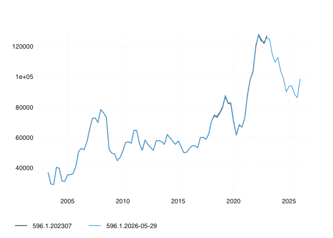

# ch.fso.besta.vacancies

The ch.fso.besta.vacancies package provides versioned time series data
and their meta information for scientific research.
In addition, the package contains the
extract-transform-load (ETL) functionality that
sources the data from its original provider.

## Browse Time Series Data

You can use GitHub's ability to render to csv to explore the datasets

## Basic Data Consumption via opentimeseries


```r
remotes::install_github("opentsi/opentimeseries")
library(opentimeseries)

# first param `series` defaults to NULL
# fetches all series from `remove_archive``
ts <- read_open_ts(
  remote_archive = "opentsi/ch.fso.besta.vacancies" 
)

ts
```


## Basic Usage of this Data Package

Given a unique time series identifier and a GitHub repo,
*opentimeseries* will return a time series and long format `data.table`.

``` r
library(opentimeseries)
a <- read_open_ts("596.1",
                  remote_archive = "opentsi/ch.fso.besta.vacancies") # total job vacancies
a
```

By specifying a date in addition, you can able to obtain other versions
but the most recent one. The *opentimeseries* package will simply select
the most recent release that was available at the selected date.

```r
a202307 <- read_open_ts("596.1",
                  remote_archive = "opentsi/ch.fso.besta.vacancies",
                  date = "2023-07-01")
```

Because time series data can get revised, storing vintages is important
to monitor data revisions and benchmark forecasts. Here’s a quick visual
comparison:

``` r
library(tsbox)
a202307$id <- sprintf("%s.202307", a202307$id)
a$id <- sprintf("%s.%s", a$id, Sys.Date())
ts_plot(rbind(a202307,a))
#> [time]: 'date'
```



<!-- ## Get Entire History of a Time Series

With opentimeseries you can get the entire history of a time series.
Note that, in order to avoid nesting structures and varying output type,
unlike read_open_ts, read_history only allows for a single time series.
Hence, read_history only processes the first element of a vector of time
series when multiple series keys are given. Note how the *lastn*
parameter allows you to limit version extraction to the last couple of
versions.

``` r

hist_triangle <- read_history("ch.kof.globalbaro.leading",
 remote_archive = "opentsi/kofethz", lastn = 5)

tail(hist_triangle)
#> Key: <date>
#>          date v2025-02-01 v2025-03-01 v2025-04-01 v2025-05-01 v2025-06-01
#>        <Date>       <num>       <num>       <num>       <num>       <num>
#> 1: 2024-01-01    111.4755   111.93393   112.22277   112.43953   112.40559
#> 2: 2024-02-01    105.5114   104.87135   105.00907   105.40360   105.42741
#> 3: 2024-03-01          NA    99.14223    98.91744    98.99472    99.09614
#> 4: 2024-04-01          NA          NA   101.05006   101.19983   101.32582
#> 5: 2024-05-01          NA          NA          NA   102.78880   102.89490
#> 6: 2024-06-01          NA          NA          NA          NA   103.87232
``` -->
